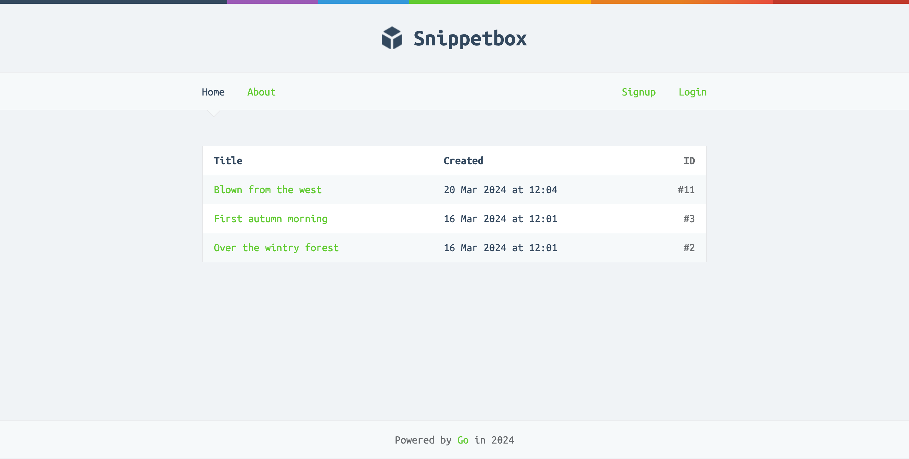

# Snippetbox

Save and share snippets of text with ease.

### Prerequisites

-   Snippetbox requires a PostgreSQL server with `snippets` and `users` tables as described in `init.sql`
-   Use the command `go run /usr/local/go/src/crypto/tls/generate_cert.go --rsa-bits=2048 --host=localhost`. Place the cert and key in `/tls`

### How to run?

Run `go run ./cmd/web --help` to see a documentation of all the supported flags
